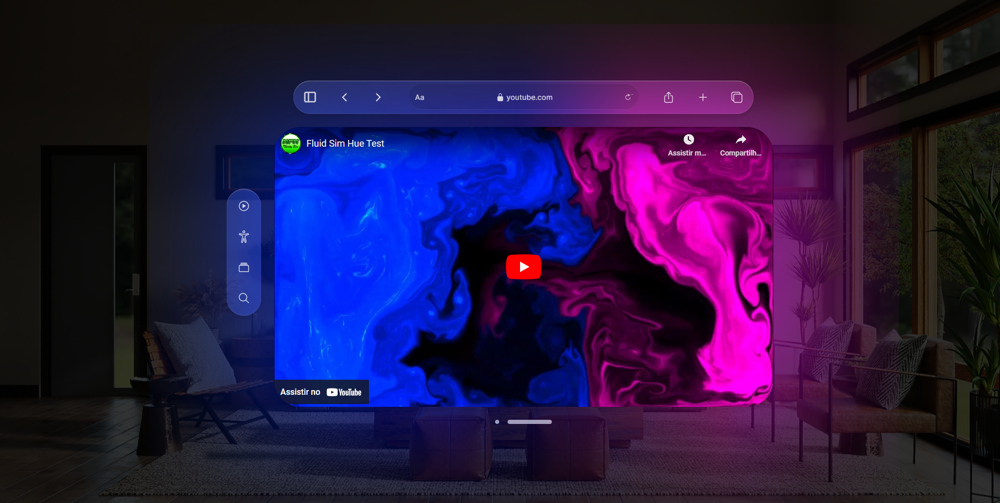

# Galeria de Fotos

Essa solução é um player de vídeo simulando uma visão de VR.
Ela também conta com animações com css e js.

## Conteúdo

- [Visão geral](#visão-geral)
  - [Desafio](#desafio)
  - [Screenshot](#screenshot)
- [Meu processo](#meu-processo)
  - [Feito com](#feito-com)
- [Autor](#autor)

## Visão Geral

### Desafio

O desafio era:
-Criar um player usando a API do Youtube

### Screenshot

## Meu processo

### Feito com

- HTML5
- Ion-Icons
- Aka Icons
- CSS Grid
- Youtube API

